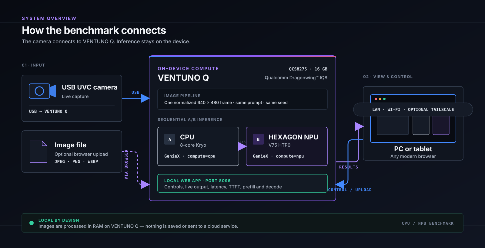

# VENTUNO Q CPU vs NPU Benchmark

A live, bilingual VLM benchmark for [Arduino VENTUNO Q](https://docs.arduino.cc/hardware/ventuno-q). It sends the same 640×480 image, prompt, seed, and generation limit to CPU and Hexagon NPU backends sequentially, then displays total latency, time to first token, input processing, generation speed, and rolling p50/p95 values.

This is an independent community project. It is not affiliated with or endorsed by Qualcomm Technologies, Inc. or Arduino.



The installer downloads and verifies the runtime and model automatically. You do not need to find or copy model files yourself.

## Install

Run these commands on a VENTUNO Q with its standard Ubuntu image and internet access:

```bash
git clone https://github.com/coconiwa/ventuno-q-ai-benchmark.git
cd ventuno-q-ai-benchmark
./install.sh
```

The initial installation downloads about 2 GB and temporarily needs at least 5 GB of free storage. It does not require `sudo` and does not modify Arduino App Lab.

Start the benchmark:

```bash
./scripts/control.sh start
```

When startup completes, the command prints the URLs you can open. Use the `Network` or `Tailscale` URL from another computer. The `127.0.0.1` URL works only in a browser running directly on the VENTUNO Q. Connect a USB UVC camera for live capture, or choose an image in the UI. The included sample image can be selected through the API for diagnostics.

Useful commands:

```bash
./scripts/control.sh status
./scripts/control.sh urls
./scripts/control.sh logs
./scripts/control.sh restart
./scripts/control.sh stop
```

Running `./install.sh` again stops this benchmark's services, reuses the verified runtime and model, and completes without downloading them again.

## What is compared

- Model: Qwen3-VL 2B Instruct, GGUF Q4_0 with F16 vision projector
- CPU: GenieX llama.cpp backend with `compute=cpu`
- NPU: the same model through GenieX with `compute=npu`, resolved to Hexagon HTP0
- Execution: sequential A/B, with CPU-first and NPU-first order alternating between runs
- Requests: independent and identical for both backends; the same GenieX cache policy applies to each service
- Input: the exact same normalized JPEG and language-specific prompt in each pair

CPU and NPU do not run simultaneously because contention for CPU and memory bandwidth would distort the comparison.

GenieX's OpenAI-compatible endpoint reports token usage but not internal llama.cpp phase timings. The UI therefore labels and calculates:

- `TOTAL`: client-observed end-to-end latency
- `TTFT`: client-observed time to the first streamed token
- `PREFILL`: TTFT, used as the observable input-processing interval
- `DECODE`: completion tokens divided by the streamed generation interval

The NPU log must contain `Found device: HTP0` and `Using 1 device(s): HTP0`; this is also checked by the end-to-end test.

## UI and privacy

- JP/EN changes both the UI language and the prompt/answer language
- Manual and automatic capture modes
- USB camera and browser image upload
- Images are normalized in RAM and are not written to disk or sent to a cloud service
- The browser UI and model services bind locally; only the web UI listens on port 8096

## Why this benchmark runs independently

This benchmark directly manages two separate GenieX services: one configured for CPU inference and the other for NPU inference. This keeps the execution environment explicit and allows the benchmark to restart only its own model services when recovering memory.

Arduino App Lab can remain installed. This benchmark runs independently and does not modify App Lab or its applications.

## Requirements

- Arduino VENTUNO Q running Linux aarch64
- Internet access during installation
- At least 5 GB free during installation
- Standard VENTUNO Q FastRPC runtime (`libcdsprpc.so.1`)
- `curl`, `tar`, `sha256sum`, `python3`, `apt-get`, and `dpkg-deb`
- Optional USB UVC camera supported by GStreamer

## Licenses

The application source is MIT licensed. The installer downloads third-party components directly from their publishers and does not repackage them in this repository:

- Qualcomm GenieX 0.6.1 — BSD-3-Clause plus Qualcomm's repository terms
- Qwen3-VL 2B Instruct — Apache-2.0
- Q4_0 conversion by bartowski — derived from the Qwen model; see its model card
- Pillow — HPND

See [THIRD_PARTY_NOTICES.md](THIRD_PARTY_NOTICES.md). Review each upstream license and applicable product terms before redistribution or commercial deployment.

Qualcomm, Qualcomm Dragonwing, Hexagon, and Kryo are trademarks or registered trademarks of Qualcomm Incorporated. Arduino and VENTUNO are trademarks of Arduino SA. All product names are used only to identify the hardware and software exercised by this benchmark.

## Development test

```bash
./tests/test_install.sh
```

The test is intended for a VENTUNO Q. It checks the installed files and hashes, starts both backends, verifies CPU and HTP0 execution from logs, exercises a real image benchmark through the HTTP API, and stops the services afterward.
